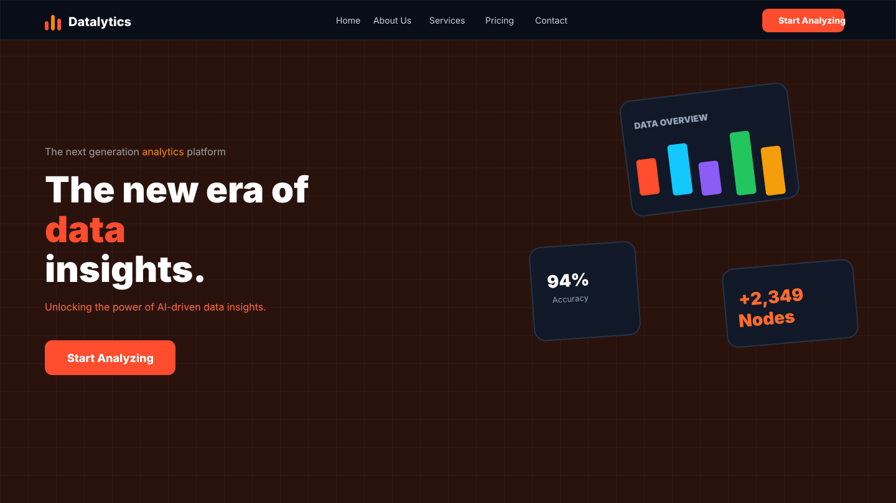

# Datalytics AI



**Datalytics AI** is an end-to-end intelligent data analytics and machine learning platform. It helps users upload datasets, clean and prepare data, generate visualizations, train ML models, create dashboards, ask AI-powered questions, export reports, manage credits, and track activity from a modern web workspace.

## Table of Contents

- [Features](#features)
- [Tech Stack](#tech-stack)
- [Project Architecture](#project-architecture)
- [Folder Structure](#folder-structure)
- [Full Workflow](#full-workflow)
- [Installation & Setup](#installation--setup)
- [Screenshots](#screenshots)
- [Author](#author)

## Features

- **Authentication**: email/password OTP verification, Google login, password reset, login/logout activity tracking.
- **Dataset Upload**: CSV, Excel, JSON, Google Sheets, JSON API, MySQL, PostgreSQL, MongoDB, and PDF connector routes.
- **Data Exploration**: automated profiling, column summaries, missing values, duplicates, distributions, and EDA outputs.
- **Data Preparation**: cleaning, preprocessing, type conversion, validation, and transformation workflow.
- **Visualization**: interactive charts, Plotly visualizations, chart recommendations, and dashboard-ready views.
- **Machine Learning**: supervised and unsupervised model training with scikit-learn, XGBoost, CatBoost, predictions, and model comparison.
- **AI Insights**: Groq/OpenAI-powered chatbot, recommendations, decision support, and smart explanations.
- **Reports**: downloadable analytics reports, PDF/Excel-style exports, summaries, and industry-style report pages.
- **Admin Panel**: analytics overview, users, payments, plans, emails, activity logs, login/logout logs, and editable admin profile.
- **Payments & Credits**: Razorpay-ready subscription/credit workflow with Free, Basic, and Pro plans.
- **Email System**: OTP emails, welcome emails, welcome-back emails, and admin announcement/warning/offer emails.

## Tech Stack

| Layer | Technologies |
| --- | --- |
| Frontend |    |
| UI & Visualization |     |
| Backend |    |
| Data & ML |      |
| Database & Queue |     |
| AI & Payments |    |

## Project Architecture

```text
User Browser
    |
    v
Next.js Client (port 5000)
    |-- Landing Page
    |-- Analytics Workspace
    |-- Admin Panel
    |-- Connector API Routes
    |
    v
FastAPI Backend (port 8000)
    |-- Auth, Admin, Upload, Data, EDA
    |-- Preprocess, Train, Predict
    |-- Visualizations, Reports, Payments
    |-- Activity Tracking, AI Chatbot
    |
    v
MongoDB / Redis / Celery / External APIs
    |-- Users, datasets, activities, payments
    |-- Background tasks and cache
    |-- Groq/OpenAI, Razorpay, SMTP
```

## Folder Structure

```text
DAT/
├── client/
│   ├── app/                    # Next.js app router pages and API connector routes
│   │   ├── admin/              # Admin entry page
│   │   ├── api/connect/        # Client-side connector endpoints
│   │   └── app/                # Main application shell route
│   ├── src/
│   │   ├── admin/              # Admin panel UI and styles
│   │   ├── auth/               # Auth context, Firebase helpers, profile store
│   │   ├── components/         # Workspace modules and reusable UI
│   │   ├── hooks/              # Dataset and app hooks
│   │   ├── pages/              # Legacy/extra pages
│   │   ├── utils/              # Dashboard, PDF, parser, and helper utilities
│   │   └── workers/            # Frontend workers
│   ├── package.json
│   └── next.config.mjs
├── server/
│   ├── app/
│   │   ├── api/v1/routes/      # FastAPI route modules
│   │   ├── core/               # Database and auth utilities
│   │   ├── middleware/         # Backend middleware
│   │   ├── models/             # Pydantic schemas
│   │   ├── services/           # ML, EDA, reports, analytics, activity services
│   │   └── state/              # Session store
│   ├── main.py                 # Uvicorn entry re-export
│   ├── requirements.txt
│   └── .env                    # Local secrets and configuration
├── docs/
│   └── screenshots/            # README screenshots and visual previews
├── .gitignore
└── README.md
```

## Full Workflow

1. **User signs up or logs in**
   The platform verifies users with OTP or Google login and tracks access history.

2. **Dataset is uploaded**
   Users upload files or connect to data sources. The backend validates, parses, profiles, and stores session data.

3. **Data is explored**
   The EDA service detects column types, missing values, duplicates, distributions, correlations, and dataset quality signals.

4. **Data is prepared**
   Users clean data, transform columns, validate ranges, handle missing values, and prepare the dataset for modeling.

5. **Visualizations are generated**
   The visualization service creates interactive charts, dashboards, and chart recommendations using Plotly and analytics helpers.

6. **Models are trained**
   ML services train and compare models for classification, regression, clustering, and prediction workflows.

7. **Predictions and insights are produced**
   Users run predictions, ask AI questions, generate recommendations, and receive decision support.

8. **Reports are exported**
   The reporting system builds structured analysis reports with summaries, charts, recommendations, and downloadable outputs.

9. **Credits and plans are managed**
   Subscription plans and user credits are managed through the payment/admin system.

10. **Admin monitors the platform**
    Admin can manage users, payments, plans, email campaigns, activity logs, login/logout logs, and analytics.

## Installation & Setup

### Prerequisites

- Node.js 18+
- Python 3.10+
- MongoDB connection string
- SMTP credentials for emails
- Optional: Redis/Celery for background jobs
- Optional: Groq/OpenAI/Razorpay keys

### Backend Setup

```bash
cd server
python -m venv .venv
.venv\Scripts\activate
pip install -r requirements.txt
uvicorn app.main:app --reload --host 127.0.0.1 --port 8000
```

Backend docs:

```text
http://127.0.0.1:8000/docs
```

### Frontend Setup

```bash
cd client
npm install
npm run dev
```

Frontend:

```text
http://localhost:5000
```

Admin panel:

```text
http://localhost:5000/admin
```

### Important Environment Variables

Create/update `server/.env` with values for:

```env
MONGO_URI=
JWT_SECRET=
SMTP_HOST=
SMTP_PORT=
SMTP_USERNAME=
SMTP_PASSWORD=
GOOGLE_CLIENT_ID=
GROQ_API_KEY=
OPENAI_API_KEY=
RAZORPAY_KEY_ID=
RAZORPAY_KEY_SECRET=
ADMIN_EMAIL=
ADMIN_PASSWORD=
```

## Screenshots

### Landing Page


### Admin Analytics

Add a screenshot at:

```text
docs/screenshots/admin-analytics.png
```

Then reference it like this:

```md

```

### Analytics Workspace

Add a screenshot at:

```text
docs/screenshots/workspace-upload.png
```

Then reference it like this:

```md

```

## Author

**Sangam Singh**  
Email: `singhsangam5400@gmail.com`

---

Built as a full-stack AI analytics platform for data upload, exploration, visualization, machine learning, reporting, payments, and admin operations.
